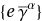

## FAHFeynmanRules

The operator takes in a Lagrangian as the first argument and a Mathematica **List** of possible field combinations as the second argument.

This will generate all the Feynman rules associated with possible field combinations. For example if we have the following:

```Mathematica
QEDLagrangian = 
 I*QuantumField[\[Psi]1]*GA[\[Mu]]* QuantumField[FCPartialD[\[Mu]], \[Psi]2] + 
 e*QuantumField[\[Psi]1]*GA[\[Mu]]*QuantumField[A, {\[Mu]}]* QuantumField[[Psi]2] - 
 m*QuantumField[\[Psi]1]*QuantumField[\[Psi]2] - 1/4*(QuantumField[FCPartialD[\[Mu]]
 , A, {\[Nu]}] - QuantumField[FCPartialD[\[Nu]], A, {\[Mu]}])
 *(QuantumField[FCPartialD[\[Mu]], A, {\[Nu]}]- QuantumField[FCPartialD[\[Nu]]
 , A, {\[Mu]}])
```

and we want to find out the Feynamn rule for `{\[Psi]1,\[Psi]2,A}` we will use 

```Mathematica
FAHFeynmanRules[QEDLagrangian, {{QuantumField[\[Psi]1][p], QuantumField[\[Psi]2][p],
 QuantumField[A, {\[Alpha]}][p]}}]
```

to get  which is essentially the vextex of a Feynman diagram in QED representing the vertex of two fermions and the photon.


