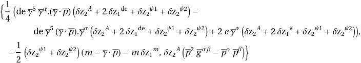
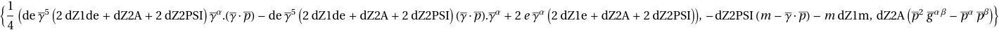

## FAHReplace

The operator takes in an expression as the first argument and a Mathematica **Association** as the 
second argument.

This is necessary because not all Mathematica symbols can be converted to a text file. In order, to generate the 
model files we need the output to be in a string form.

Suppose, we want to change this output to a form that will be easier to generate text files.


| temp =      |  |
| ----------- | ----------- |


```Mathematica
FAHReplace[(temp //. \[Psi]1 -> \[Psi] //. \[Psi]2 -> \[Psi]), <|\[Psi] -> PSI, A -> A |>]
```


The Lorentz object in the output can be handled using operators like **WriteGENOutput**, **WriteGenProp**, etc.
