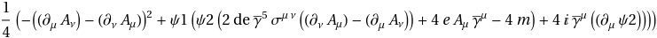
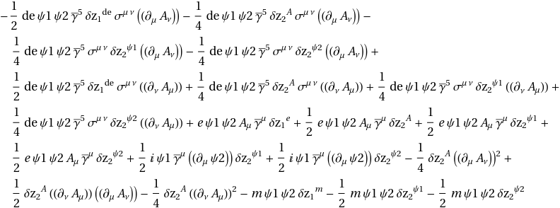
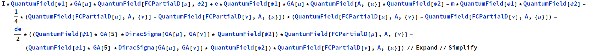

## GetCounterTermLagrangian

The operator is called in like this:

**GetCounterTermLagrangian[inputLagrangian, scalarList]**

This operator will return an expression for the Counter Term Lagrangian in FeynCalc language.

This operator will take will two arguments:

*   inputLagrangian is the Lagrangian written in FeynCacl
*   scalarList is a List of the scalar terms in the Lagrangian

and return one output.

For example:

If we call **GetCounterTermLagrangian[Lagrangian, {m, e, de}]** on the following Lagrangian

we will get output below:

Please note: Lagrangian has to be written using **FeynCalc**. For example, the Lagrangian mentioned above
will be written as: 

